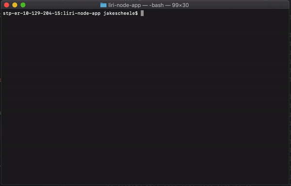

# LIRI BOT

LIRI is a Language Interpretation and Recognition Interface. LIRI is a command line node app that takes in parameters and gives you back data.

Be sure to install necessary npm packages.

Use LIRI to perform searches on songs, movies, or concerts! 

Using the command line, perform searches using the following format: 
`node liri.js search-type search-parameter`

Search types are listed below.

    Song Search by Song Title: spotify-this-song

    EX: 

    Concert Search by Artist: concert-this

    EX: 

    Movie Seach by Title: movie-this

    EX: 

    Enter do-what-it-says as a search type to search the contents of the random.txt file. File must contain search type and search parameters.

    EX: 